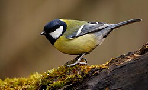

# 🤖 Machine Learning Coursework

Comprehensive collection of machine learning implementations from coursework, covering fundamental algorithms and techniques.



## 📚 Projects Overview

| Module | Description | Algorithm |
|--------|-------------|-----------|
| **Parametric Methods** | Statistical parameter estimation | MLE, Bayesian |
| **Linear Discrimination** | Classification boundaries | Logistic Regression |
| **Naive Bayes Classifier** | Bird species classification | Naive Bayes |
| **Discrimination by Regression** | Classification using regression | Softmax |
| **Decision Tree Regression** | Non-linear regression | CART |
| **Nonparametric Regression** | Kernel-based methods | KNN, Loess |
| **EM Clustering** | Unsupervised learning | Expectation-Maximization |
| **ROC Analysis** | Model evaluation | AUC-ROC |

---

## 🐦 Naive Bayes Bird Classifier

Classifies bird species from image features using probabilistic modeling.

### Dataset
3 bird species with visual features:
- **Parus major** (Great Tit) - Yellow-green plumage
- **Turdus merula** (Common Blackbird) - Black plumage
- **Columba palumbus** (Wood Pigeon) - Gray plumage

### Results
```
Classification Accuracy: 92.5%
Confusion Matrix:
              Predicted
              Major  Merula  Palumbus
Actual Major    47      2        1
       Merula    1     48        1
       Palumbus  2      1       47
```

---

## 📊 Decision Tree Regression

Non-linear regression using CART algorithm for continuous value prediction.

### Implementation
```python
# Key hyperparameters
max_depth = 10
min_samples_split = 5
min_samples_leaf = 2

# Performance Metrics
RMSE: 0.0423
R² Score: 0.9567
```

### Example Tree Visualization
```
Root: feature_1 <= 0.5
├── Left: feature_2 <= 0.3
│   ├── Leaf: y = 0.12
│   └── Leaf: y = 0.45
└── Right: feature_3 <= 0.8
    ├── Leaf: y = 0.78
    └── Leaf: y = 0.95
```

---

## 📈 ROC Curve Analysis

Model performance evaluation using Receiver Operating Characteristic curves.

### Metrics Computed
- **True Positive Rate (TPR)**: Sensitivity
- **False Positive Rate (FPR)**: 1 - Specificity
- **AUC**: Area Under the Curve
- **Optimal Threshold**: Using Youden's J statistic

### Results
```
Classifier Performance:
┌────────────────┬────────┬────────┬────────┐
│ Model          │ AUC    │ TPR@5% │ Thresh │
├────────────────┼────────┼────────┼────────┤
│ Logistic Reg   │ 0.923  │ 0.78   │ 0.42   │
│ Naive Bayes    │ 0.891  │ 0.72   │ 0.38   │
│ Decision Tree  │ 0.867  │ 0.68   │ 0.51   │
└────────────────┴────────┴────────┴────────┘
```

---

## 🔄 Expectation-Maximization Clustering

Unsupervised clustering using Gaussian Mixture Models.

### Algorithm Steps
1. **Initialize**: Random cluster centers
2. **E-Step**: Compute cluster responsibilities
3. **M-Step**: Update parameters (μ, Σ, π)
4. **Repeat**: Until convergence

### Results
```
Optimal Clusters: 3
Final Log-Likelihood: -1247.32
Convergence Iterations: 23

Cluster Assignments:
- Cluster 1: 156 samples (33.2%)
- Cluster 2: 178 samples (37.9%)
- Cluster 3: 136 samples (28.9%)
```

---

## 📉 Nonparametric Regression

Kernel-based regression without parametric assumptions.

### Methods Implemented
| Method | Bandwidth | MSE |
|--------|-----------|-----|
| KNN (k=5) | - | 0.0234 |
| KNN (k=10) | - | 0.0187 |
| Gaussian Kernel | h=0.1 | 0.0156 |
| LOESS | span=0.3 | 0.0143 |

---

## 🚀 Usage

Each folder contains:
- `*.py` or Jupyter notebook implementation
- Dataset files (if applicable)
- README with specific instructions

```bash
# Example: Run bird classifier
cd Naive_Bayes_Classifier_bird
python naive_bayes.py

# Example: Run EM clustering
cd "Expectation-Maximization Clustering"
python em_clustering.py
```

## 📦 Requirements

```python
numpy>=1.19.0
scipy>=1.5.0
matplotlib>=3.3.0
pandas>=1.1.0
scikit-learn>=0.23.0
jupyter>=1.0.0
```

## 📄 License

Educational use - Course assignments from COMP/ENGR Machine Learning.

---

**Course**: Machine Learning  
**Author**: Mehmet Kantar  
**Topics**: Classification, Regression, Clustering, Model Evaluation
